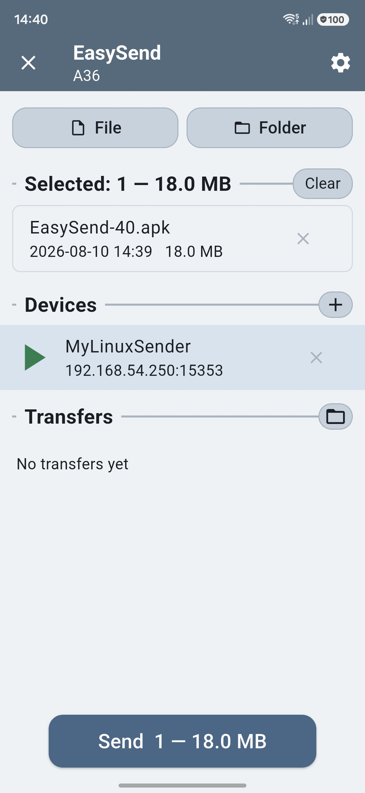
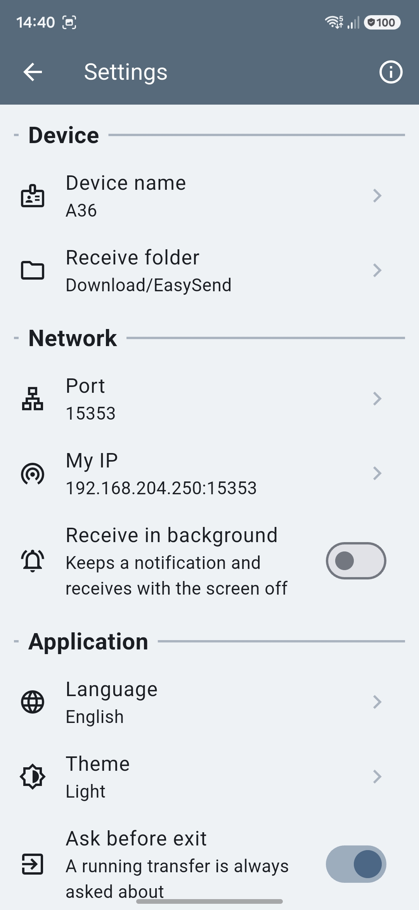

# EasySend

EasySend sends files and folders straight from one device to another over the local
network — Android to desktop, desktop to Android, phone to phone. No account, no cloud,
no internet: the two devices talk to each other and nothing else.

<table>
  <tr>
    <td></td>
    <td></td>
  </tr>
  <tr>
    <td align="center">Pick, choose, send</td>
    <td align="center">Settings</td>
  </tr>
</table>

## Features

- **One screen** — pick files or folders, choose a device, press Send. Folders keep their
  structure at the far end. On the desktop you can also drop files onto the window; on
  Android the app appears in the system Share menu with the files already filled in.
- **Devices find each other** — a UDP announce every five seconds on the local subnet.
  Anything behind a router does not hear a broadcast, so it is added by hand as `IP` (or
  `IP:port`) and polled over HTTP instead; a device that has sent to you once is
  remembered with the address it came from.
- **Ask once, then trust** — an unknown sender has to be confirmed on the receiving
  device. "Always trust" binds that answer to the sender's id, and trusted devices are
  listed in the settings, revocable one by one.
- **Transfers you can watch** — a progress bar in bytes for the whole transfer, current
  file, speed and time left. Either side can stop a running transfer. Files arrive under a
  private incomplete-session directory and get their real names only after their CRC32
  matches; a mismatch is re-sent automatically twice before it is called a failure.
- **Every transfer explains itself** — tap one to open its log: what happened to each file,
  response codes, refusal reasons, a line per failed attempt. One button copies the whole
  thing, build number included, so a bug report does not have to be typed off a phone
  screen. A log holds 500 lines, and the ones it gives up first are the files that simply
  arrived — a failure is never pushed out by a thousand successes, and a trimmed log ends
  with the count of the files it stopped naming. It lives in memory and goes with the app;
  the app keeps no history between runs.
- **Move instead of copy** — the *delete originals* tick beside Send removes each source
  once that file has been received and verified at the far end. The file is the unit: what
  did not get there stays where it is, a cancelled transfer deletes nothing, and the tick
  clears itself afterwards so the next send has to ask for it again.
- **Receiving with the screen off** (Android) — an optional foreground service keeps the
  port open and puts an incoming request in a notification you can accept from the
  lock screen.
- **Themes and languages** — five palettes (Light, Dark, Sand, Slate, Olive) plus System,
  and English, Russian and Ukrainian. Both are data, not code: add a palette to
  `assets/colors.json` or a locale to `assets/locales.json` and it shows up in the
  settings. `palette-preview.html` renders the home screen in every palette with WCAG
  contrast ratios beside each colour, so a theme can be judged without a build.

## Where files land

A subfolder `EasySend` inside the system downloads folder — `Download/EasySend` on
Android, the XDG downloads folder on Linux, the known Downloads folder on Windows. It is
created on the first transfer and can be changed in the settings.

## Network

Two ports, and they are not the same one. Discovery always listens on 15353 — a multicast
announce to `239.255.53.53` with a limited broadcast behind it for anything that filters
multicast. The transfer port is what the settings change; it travels inside the announce,
so two devices set to different transfer ports still find each other and connect to the
port each one named. 15353 is the default for both, which is why they look like one.

Transfers are plain HTTP under `/api/v1`: `prepare` announces a manifest, `upload` streams
one file, `verify` checks its checksum, `finish` closes the session. `SPEC.md` (in
Russian) describes it in full.

**Traffic is not encrypted.** That is a deliberate trade for simplicity on a home or
office network, and it has a price: anyone on the same network can read what is being
transferred, and a sender's identity is not proven by anything cryptographic. Do not use
it on public or guest Wi-Fi.

## Build

Flutter, one codebase for Android and desktop. The numbered scripts do the work:

```
./05-Lint.sh           # flutter analyze
./06-Test.sh           # flutter test
./00-MakeAll.sh        # everything: APK, both installs, AppImage
./01-LinkOut.sh        # link the newest build into OUT/ under its own names
./10-MakeRelease.sh    # release APKs, one build number up
./11-EmulRELEASE.sh    # install the freshest APK on the emulator
./12-PhoneRELEASE.sh   # install it on the phone
./13-MakeLinux.sh      # Linux desktop release
./14-MakeAppImage.sh   # pack that release into one AppImage
```

`20-MakeTag.sh`, `21-PushTag.sh` and `22-RelUpload.sh` tag a release and upload it.
`tools/make_icon.py` draws the app icon as geometry and writes the masters into `assets/`.

The Linux build needs `clang cmake ninja-build pkg-config libgtk-3-dev` and a linker
beside clang (`lld`); `13-MakeLinux.sh` checks for both and says what is missing.

### Signing

The Android release is signed with a key kept outside the repository:
`~/.my-safe/key.properties`, read by `android/app/build.gradle.kts` at configuration
time. It is an ordinary Gradle properties file:

```properties
storeFile=/home/you/.my-safe/my-release-key.jks
storePassword=…
keyAlias=…
keyPassword=…
```

Without that file the release build stops before it starts. `bash 77-MakeMyKey.sh` makes
both the keystore and the properties file for you — it carries no execute bit, since it
is a once-in-a-project step and not part of any build, and it refuses to run when either
file already exists. To build without signing at all, drop the `signingConfigs` block and
the `signingConfig` line from `android/app/build.gradle.kts`. The Linux build needs none
of this.

## Note

This codebase was developed with the help of artificial intelligence tools.
